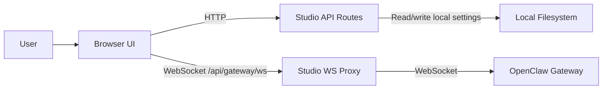

# Архитектура

## Обзор
Office3D — это Next.js-приложение, построенное вокруг шлюза (gateway-first), для визуализации ИИ-агентов на базе OpenClaw и управления ими; 3D-часть построена на фреймворке Three.JS.

Это слой интерфейса и прокси, а не сама среда выполнения OpenClaw. OpenClaw остаётся основной системой учёта агентов, сессий и выполнения, а Office3D предоставляет:

- рабочее пространство `/agents` для чата, одобрений, настроек и наблюдения за средой выполнения,
- 3D-среду `/office`, которая переносит активность агентов в пространство,
- раздел `/office/builder` для редактирования планировок офиса,
- слой настроек и прокси на стороне Studio, который соединяет браузер с вышестоящим шлюзом OpenClaw.

## Цели
- Оставлять OpenClaw источником истины для состояния среды выполнения.
- Ограничивать локальное состояние Studio настройками интерфейса и параметрами подключения.
- Поддерживать как локальные, так и удалённые конфигурации шлюза.
- Сохранять чёткие границы между браузерным кодом, серверным кодом и данными, которыми владеет шлюз.
- Предпочитать модули, сосредоточенные на отдельных возможностях, крупным общим абстракциям.

## Не цели
- Многопользовательская или мультиарендная координация.
- Замена OpenClaw в роли движка выполнения.
- Перенос состояния агентов, которым владеет шлюз, в локальное хранилище фронтенда.

## Модель системы
Office3D состоит из четырёх основных частей:

1. Браузерный интерфейс.
   Клиент Next.js отрисовывает рабочее пространство агентов, офис и конструктор.
2. API-маршруты Studio.
   Серверные маршруты обрабатывают локальные настройки и другие операции, доступные только на сервере.
3. WebSocket-прокси Studio.
   Собственный Node-сервер принимает браузерные WebSocket-соединения на `/api/gateway/ws` и перенаправляет их на вышестоящий шлюз OpenClaw.
4. Шлюз OpenClaw.
   Шлюз владеет записями агентов, сессиями, конфигурацией, одобрениями и событиями среды выполнения.

## Основные границы
### 1. Состояние, которым владеет шлюз
Записи агентов, сессии, одобрения, потоки среды выполнения и файлы агентов принадлежат OpenClaw.

Office3D может читать и изменять это состояние через API шлюза, но не должен создавать конкурирующий локальный источник истины.

### 2. Локальное состояние, которым владеет Studio
Studio хранит локальные настройки, такие как:

- URL и токен шлюза,
- выбранный агент и связанные настройки интерфейса,
- планировка офиса и локальное состояние отображения.

Эти настройки хранятся в локальном каталоге состояния OpenClaw, и доступ к ним идёт через серверные маршруты, а не напрямую из браузера.

### 3. Граница между клиентом и сервером
Клиентские компоненты не должны напрямую читать или записывать локальную файловую систему.

Всё, что затрагивает файлы, настройки из окружения или SSH-помощники, относится к серверной стороне.

### 4. Граница между браузером и шлюзом
Браузер не подключается к вышестоящему шлюзу напрямую. Он подключается к Studio по WebSocket с того же источника (same-origin), а Studio открывает соединение с вышестоящим шлюзом на сервере.

Так соединение с вышестоящим шлюзом управляется сервером, и проще поддерживать локальные, удалённые и туннелированные конфигурации. Текущий интерфейс всё ещё загружает настроенные URL и токен вышестоящего шлюза в память браузера во время работы, поэтому браузер остаётся частью активной границы доверия.

## Основные потоки
### Поток подключения
1. Интерфейс загружает настройки Studio из `/api/studio`.
2. Браузер открывает WebSocket к `/api/gateway/ws`.
3. Прокси Studio загружает URL и токен вышестоящего шлюза на стороне сервера.
4. Studio открывает соединение с вышестоящим шлюзом и пересылает кадры между браузером и шлюзом.

### Поток среды выполнения агентов
1. Интерфейс подключается через прокси Studio и запрашивает состояние шлюза.
2. События среды выполнения передаются потоком из шлюза в интерфейс агентов.
3. Рабочее пространство агентов выводит из этого потока событий чат, статусы, одобрения и сводки.
4. Вид офиса выводит анимацию и активность в комнатах из тех же сигналов среды выполнения.

### Поток офиса
1. Офис подписывается на состояние среды выполнения агентов.
2. Логика триггеров событий превращает активность среды выполнения в пространственные сигналы.
3. 3D-сцена отрисовывает перемещение агентов, активность в комнатах и временное поведение уборщиков и сброса на основе производного состояния.

## Структура репозитория
- `src/app`: маршруты, макеты и API-эндпоинты.
- `src/features/agents`: интерфейс рабочего пространства агентов и обработка состояния среды выполнения агентов.
- `src/features/office`: экраны офиса, панели и интерфейс конструктора.
- `src/features/retro-office`: 3D-сцена, навигация, персонажи и вспомогательные функции отрисовки.
- `src/lib`: адаптеры шлюза, настройки Studio, логика вывода состояния офиса и общие утилиты.
- `server`: собственный сервер Studio и WebSocket-прокси.

Практическую карту кода и руководство по расширению для участников см. в `CODE_DOCUMENTATION.md`.

## Принципы проектирования
- Шлюз прежде всего.
  Если данные относятся к среде выполнения, они должны жить в OpenClaw, а не в локальном файле фронтенда.
- Производное состояние интерфейса вместо дублирования.
  Интерфейс должен выводить представления из событий шлюза и локальных настроек, а не создавать параллельные записи.
- Организация по возможностям.
  Держите бо́льшую часть логики интерфейса внутри модулей возможностей и выносите в `src/lib` только действительно общие утилиты.
- Узкие серверные границы.
  Доступ к файловой системе, SSH-помощники и обработка токенов должны оставаться на стороне сервера.
- Стабильная архитектурная документация.
  Этот документ должен описывать границы и замысел, а не каждый помощник, хук или файл рабочего процесса.

## Важные решения
- Локальные настройки хранятся в JSON-хранилище, а не в базе данных.
  Это делает приложение простым и ориентированным на локальную работу ценой отказа от многопользовательского режима.
- Трафик браузера идёт через прокси Studio с того же источника, а не напрямую к шлюзу.
  Это добавляет один переход, но оставляет учётные данные на сервере и делает развёртывание гибче.
- Конфигурация и файлы агентов управляются через API шлюза.
  Это предотвращает расхождение между Office3D и вышестоящей средой выполнения.
- Поведение офиса управляется производным состоянием событий, а не императивными изменениями сцены.
  Благодаря этому 3D-слой лучше воспроизводится и тестируется.

## Ограничения
- Не храните токены шлюза и секреты в постоянном хранилище на стороне клиента.
- Не читайте и не записывайте локальные файлы из клиентских компонентов.
- Не создавайте второй источник истины для записей агентов вне шлюза.
- Не записывайте конфигурацию агентов, которой владеет шлюз, напрямую в локальные файлы конфигурации OpenClaw.
- Не добавляйте параллельные эндпоинты настроек Studio, когда эту обязанность уже выполняет `/api/studio`.
- Не добавляйте тяжеловесные абстракции без явной необходимости.

## Направление развития
- Если многопользовательский режим станет важен, замените локальное хранилище настроек слоем хранения на основе сервиса и добавьте аутентификацию на границе API.
- Если протокол шлюза изменится, изолируйте последствия внутри `src/lib/gateway` и границы прокси Studio.

Текущие оговорки к публикации и нерешённые задачи см. в `KNOWN_ISSUES.md`.

## Диаграмма

