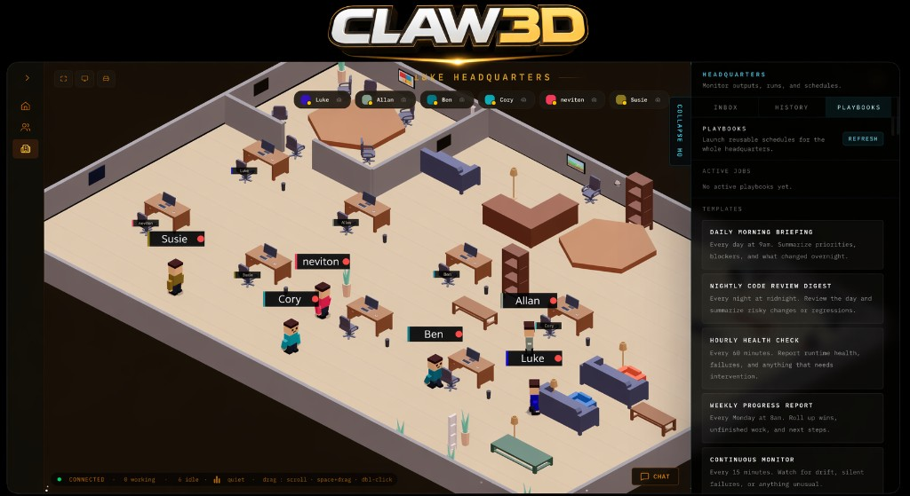

# Office3D — 3D-офис для ИИ-агентов

<p align="center">
    
</p>

<p align="center">
  <strong>ОФИС ДЛЯ ВАШЕЙ ИИ-КОМАНДЫ!</strong>
</p>

<p align="center">
  <a href="https://github.com/mazhievadlan7/Office3D/actions/workflows/docker-publish.yml?query=branch%3Amain"></a>
  <a href="https://github.com/mazhievadlan7/Office3D/releases"></a>
  <a href="LICENSE"></a>
</p>

**Office3D** — это _виртуальный 3D-офис для ИИ-агентов_, который работает на вашей собственной инфраструктуре.
Вместо того чтобы следить за автоматизацией через дашборды и логи, вы ходите по живому 3D-офису, где агенты вместе работают, проверяют код, проводят планёрки, выпускают пул-реквесты и выполняют задачи бок о бок. Шлюз — лишь панель управления, а сам продукт — это офис.

Если вам нужно личное рабочее пространство на своём сервере, которое превращает ИИ-команду в то, что можно по-настоящему _увидеть_, — это оно.

Поддерживаемые среды выполнения: шлюз OpenClaw, Hermes, прямое HTTP-подключение `custom` для стеков с собственным оркестратором и встроенный демо-шлюз, чтобы осмотреть офис без настоящего фреймворка агентов.

[Видение](VISION.md) · [Архитектура](ARCHITECTURE.md) · [Руководство](TUTORIAL.md) · [Быстрый старт](#быстрый-старт) · [Развёртывание](docs/deployment.md) · [Профили сред](docs/runtime-profiles.md) · [Мультиагентная бета](docs/multi-agent-beta.md) · [Участие](CONTRIBUTING.md) · [Безопасность](SECURITY.md)

> **Неофициальный проект.** Office3D — независимый проект сообщества. Он не связан с командой OpenClaw, не одобрен и не поддерживается ею. OpenClaw — отдельный проект, и этот репозиторий не является официальным репозиторием OpenClaw.

Office3D — приватный форк [Claw3D](https://github.com/iamlukethedev/Claw3D), созданного **LukeTheDev** и выпущенного под лицензией MIT. Форк независимо поддерживает [@mazhievadlan7](https://github.com/mazhievadlan7); с исходным проектом он не связан.

## Язык

Интерфейс Office3D полностью на русском. Все фразы собраны в одном словаре — [`src/lib/i18n/ru.ts`](src/lib/i18n/ru.ts) — и выводятся через `t("область.ключ")` из `@/lib/i18n`. Даты, время и числа форматируются в локали `ru-RU` независимо от языка браузера.

Агенты тоже работают по-русски: инструкции, которые им отправляет офис, и упакованные навыки написаны на русском, а просьбы вроде «давайте проведём планёрку» офис понимает наравне с английскими.

Документация репозитория (`docs/`, руководство, архитектура и остальные файлы в корне) тоже на русском; текст лицензии (`LICENSE`) оставлен в оригинале, поскольку юридическую силу имеет он.

## Что можно делать в Office3D

- **Наблюдать за работой ИИ-агентов в реальном времени** в 3D-штабе — зале на сотни рабочих мест.
- **Проводить планёрки** с агентами, подключёнными к GitHub и Jira.
- **Вести задачи на канбан-доске** и смотреть историю запусков и аналитику в боковой панели штаба.
- **Устанавливать агентам навыки** из маркетплейса.
- **Звонить и отправлять сообщения** от имени агентов — номер и отправку подтверждает человек.
- **Начинать новые сессии** агентов прямо из чата.

## Что такое Office3D

Office3D — это слой визуализации и взаимодействия.

Сегодня он может работать поверх:

- OpenClaw — через существующий шлюз;
- Hermes — через встроенный WebSocket-адаптер;
- прямого HTTP-подключения `custom` для стеков с собственным оркестратором;
- встроенного демо-шлюза, чтобы осмотреть офис без настоящего фреймворка агентов.

На практике приложение даёт:

- 3D-штаб `/office` — зал на сотни рабочих мест, где агенты работают за столами и ходят по залу, как сотрудники;
- конструктор `/office/builder` для редактирования и публикации планировок офиса;
- архитектуру «сначала шлюз»: состояние среды выполнения хранится в подключённом бэкенде, а Studio хранит только локальные настройки интерфейса;
- независимый от бэкенда слой среды выполнения внутри Studio, так что новых поставщиков можно подключать, не переписывая весь интерфейс.

Этот репозиторий не собирает сами среды выполнения. Это фронтенд, Studio и слой адаптеров и прокси, который подключается к среде, говорящей на протоколе шлюза Office3D.

## Зачем он нужен

ИИ-системы становятся всё способнее, но их работа обычно по-прежнему спрятана в логах, выводе терминала и дашбордах.

Office3D делает системы агентов видимыми:

- смотреть, что делают агенты, в реальном времени;
- следить за запусками, одобрениями, историей и активностью в одном месте;
- общаться с агентами в чате и голосом;
- двигаться к миру, где ИИ-системы понятны через пространство, движение и присутствие.

Общее направление проекта описано в [`VISION.md`](VISION.md).

## Что уже есть

Текущее приложение уже включает большую часть Office3D:

- Управление командой и чат с агентами; обновления среды выполнения приходят потоком от шлюза.
- Создание агентов, настройки, управление сессиями, одобрения и редактирование конфигурации через шлюз.
- 3D-штаб на 300 столов (можно 100 или 1000): процедурный план зала, симуляция толпы, анимированные персонажи и подсказки об активности по событиям. Модели штаба собираются скриптами Blender из `blender/`.
- Боковая панель штаба: входящие, история запусков, канбан, плейбуки с планёрками и аналитика.
- Локальное хранение в Studio: подключение к шлюзу, выбранный агент, состояние офиса и связанные настройки интерфейса.
- Собственный WebSocket-прокси на том же origin: браузер общается со Studio, а Studio — с вышестоящим шлюзом OpenClaw.

## Быстрый старт

Требования:

- Node.js 24 LTS (минимум 22.22; Node 20 больше не поддерживается).
- npm 10+ (рекомендуется).
- Одно из:
  - рабочая установка OpenClaw с доступным адресом шлюза и токеном;
  - Hermes со встроенным адаптером;
  - встроенный демо-шлюз для локального знакомства.

Перед началом:

- Office3D не устанавливает и не собирает за вас OpenClaw или Hermes.
- Прежде чем запускать Office3D с настоящим бэкендом, убедитесь, что выбранная среда выполнения уже работает и что вы знаете адрес шлюза и токен для Studio.
- Чтобы посмотреть офис локально без фреймворка, запустите встроенный демо-шлюз.
- Полное руководство по настройке на нескольких машинах (OpenClaw + Tailscale + Office3D) — в [`TUTORIAL.md`](TUTORIAL.md).

Запуск из исходников:

```bash
git clone <адрес-вашего-репозитория> office3d
cd office3d
npm install
cp .env.example .env
npm run dev
```

Затем откройте `http://localhost:3000` и укажите в Studio адрес шлюза и токен.
Studio также сохраняет выбранный режим бэкенда («Бэкенд OpenClaw», «Бэкенд Hermes», «Демо-бэкенд», «Локальная среда», «Среда Office3D» или «Свой бэкенд») и показывает активный бэкенд, о котором сообщает подключённый шлюз.

### Профили сред выполнения

Если вы подключаете среду с собственным оркестратором через прямое HTTP-подключение, сначала запустите её, затем Office3D:

```bash
npm run dev
```

Затем откройте `http://localhost:3000`, выберите «Локальная среда», «Среда Office3D» или «Свой бэкенд» и укажите адрес вашей среды выполнения.
Типичные примеры:

```text
http://127.0.0.1:7770
```

```text
http://localhost:3000/api/runtime/custom
```

Что сейчас ожидается от среды при прямом подключении:

- `GET /health`
- `GET /state`
- `GET /registry`
- `POST /v1/chat/completions`

Браузер не обращается к этой среде напрямую. Office3D проксирует поставщика `custom` через собственный маршрут на том же origin — `/api/runtime/custom`. Это избавляет от проблем с CORS в браузере и отделяет транспорт поставщика от пути через шлюз OpenClaw/Hermes.

### Демо-режим

Если хочется просто посмотреть на офис и работу агентов, не устанавливая OpenClaw или Hermes:

```bash
npm run demo-gateway
npm run dev
```

Затем подключите Studio к:

```text
ws://localhost:18789
```

Так запускается локальный тестовый шлюз с командой демо-агентов, потоковым чатом, превью сессий и присутствием в офисе. Демо-агенты отвечают по-русски.
На экране подключения выберите «Демо-бэкенд» и нажмите «Подключиться».

Кто работает в демо-офисе:

- Первый агент — руководитель AM7 (идентификатор `main`, роль «Руководитель»). Это главный агент офиса: его нельзя удалить, голос по Alt по умолчанию уходит ему, а при обращении ко всей команде (Alt+Shift) именно он распределяет работу.
- Остальные — продуктовая команда: идентификаторы `agent-001`…`agent-999`, короткие позывные (Nyx, Vex, Kade…) и роли по кругу — исследования, разработка, аналитика, данные, дизайн, DevOps, тестирование, тексты, планирование, поддержка.
- Пока вы никому не пишете, шлюз сам раздаёт фоновую работу: каждые 2–6 секунд несколько свободных агентов берут задачу на 20–120 секунд, поэтому занято около половины команды (35–60 %), а руководитель — почти всё время. Для офиса такой запуск выглядит как настоящий: задача, начало работы, короткая строка о ходе дела, итог.
- Если написать агенту, его фоновая задача прерывается, и полторы минуты он занят только вами. То же после кнопки остановки.

Настройки демо-шлюза — это переменные окружения процесса `npm run demo-gateway` (файл `.env` он не читает):

- `DEMO_AGENT_COUNT` — размер команды вместе с руководителем: по умолчанию 333 (332 рабочих места в штабе — 10 полных рядов веером — и остров AM7), допустимо от 1 до 1000.
- `DEMO_AMBIENT_ACTIVITY=0` выключает фоновую работу: агенты заняты только тем, что вы им пишете.
- `DEMO_ADAPTER_PORT` — порт шлюза, по умолчанию 18789.

```bash
DEMO_AGENT_COUNT=300 npm run demo-gateway
```

В PowerShell:

```powershell
$env:DEMO_AGENT_COUNT = "300"; npm run demo-gateway
```

### Hermes Agent (по умолчанию)

Hermes Agent от Nous Research — бэкенд по умолчанию: каждый агент офиса —
отдельный профиль Hermes со своей памятью, навыками и ключами.

```bash
cp .env.example .env      # задайте STUDIO_ACCESS_TOKEN и секреты HERMES_*
docker compose up -d
docker compose exec hermes hermes setup   # один раз: модели и ключи провайдера
```

Без Docker, при установленном `hermes`: `npm run hermes-local`.
Экран подключения выбирать не нужно — сервер Office3D подключает Hermes сам.
Подробности — в [`docs/hermes-gateway.md`](docs/hermes-gateway.md), архитектура —
в [`docs/hermes-platform.md`](docs/hermes-platform.md).

## Как устроено подключение

Office3D использует два отдельных сетевых участка:

1. Браузер → Studio по HTTP и через WebSocket на том же origin по адресу `/api/gateway/ws`.
2. Studio → шлюз OpenClaw через второй WebSocket, который открывает сервер Studio.

Поэтому `ws://localhost:18789` всегда означает шлюз, доступный с хоста Studio, а не обязательно с устройства, на котором открыт браузер.

Такая схема хранит настройки шлюза на хосте Studio и позволяет Studio открывать соединение со шлюзом на стороне сервера. Сохранённый токен шлюза обратно в браузер не отдаётся: `/api/studio` его не возвращает, а прокси Studio (`server/gateway-proxy.js`) сам подставляет его в соединение. В памяти браузера токен бывает только пока вы вводите его в форму.

## Типичные конфигурации

### Шлюз локально, Studio локально

1. Запустите Studio командой `npm run dev`.
2. Откройте `http://localhost:3000`.
3. Укажите `ws://localhost:18789` и токен шлюза OpenClaw.

### Шлюз удалённо, Studio локально

Подойдёт любой адрес шлюза, доступный с вашей машины.

Рекомендуемый вариант — Tailscale:

1. На хосте шлюза выполните `tailscale serve --yes --bg --https 443 http://127.0.0.1:18789`.
2. В Studio укажите `wss://<хост-шлюза>.ts.net`.

Вариант через SSH:

1. Выполните `ssh -L 18789:127.0.0.1:18789 user@<хост-шлюза>`.
2. В Studio укажите `ws://localhost:18789`.

### Studio удалённо, шлюз удалённо

1. Запустите Studio на удалённом хосте.
2. Откройте доступ к Studio в частной сети или через Tailscale.
3. Задайте `STUDIO_ACCESS_TOKEN`, если Studio слушает публичный адрес.
4. Укажите адрес шлюза и токен в самой Studio.

### Studio в локальной сети или Tailscale для других устройств

1. Запустите Studio с `HOST=0.0.0.0` (или с конкретным адресом в локальной сети или Tailscale).
2. Задайте `STUDIO_ACCESS_TOKEN`, прежде чем открывать Studio за пределы localhost.
3. Открывайте Office3D по адресу в локальной сети или Tailscale, а не по `localhost`.
4. Если вы подключаетесь к удалённому шлюзу OpenClaw, помните: одобрение устройства выдаётся отдельно для каждого браузера или устройства. Новому браузеру может понадобиться:

```bash
openclaw devices approve --latest
```

## Технологии

- Next.js App Router, React и TypeScript — основное веб-приложение.
- Собственный Node-сервер — WebSocket-прокси на стороне Studio.
- Three.js, React Three Fiber и Drei — 3D-офис.
- Phaser — просмотр и конструктор офиса и связанные интерактивные экраны.
- Vitest — модульные тесты, Playwright — сквозные тесты.

## Настройка

Важные пути:

- Конфигурация OpenClaw: `~/.openclaw/openclaw.json`
- Настройки Studio: `~/.openclaw/office3d/settings.json`

Основные переменные окружения:

- `HOST` и `PORT` — адрес и порт, которые слушает сервер Studio.
- `STUDIO_ACCESS_TOKEN` защищает Studio, когда она слушает публичный адрес: это пароль на странице входа.
- `STUDIO_LOGIN` (необязательно, вместе с токеном) добавляет на страницу входа поле «Логин». `STUDIO_OWNER_NAME` — имя, по которому система штаба приветствует после входа (по умолчанию — логин). Имя живёт только в `.env` на сервере.
- `UPSTREAM_ALLOWLIST` ограничивает, к каким хостам шлюзов Studio может проксировать соединения. Задайте её в продакшене.
- `CUSTOM_RUNTIME_ALLOWLIST` ограничивает, к каким хостам может обращаться `/api/runtime/custom`. Если не задана, используется `UPSTREAM_ALLOWLIST`.
- `NEXT_PUBLIC_GATEWAY_URL` задаёт адрес шлюза по умолчанию, когда настройки Studio пусты. **Внимание:** это переменная времени сборки — изменения вступают в силу только после `npm run build`.
- `OFFICE3D_GATEWAY_URL` и `OFFICE3D_GATEWAY_TOKEN` — альтернатива `NEXT_PUBLIC_GATEWAY_URL`, которая применяется при перезапуске сервера без пересборки.
- `OFFICE3D_GATEWAY_ADAPTER_TYPE` вместе с `OFFICE3D_GATEWAY_URL` указывает тип этих значений по умолчанию: `openclaw`, `hermes`, `demo`, `local`, `office3d` или `custom`.
- `HERMES_API_URL`, `HERMES_API_KEY`, `HERMES_DASHBOARD_URL`, `HERMES_DASHBOARD_TOKEN` и `OFFICE3D_HERMES_KEY_SECRET` подключают Hermes; с `HERMES_API_URL` Hermes становится бэкендом по умолчанию (см. [`docs/hermes-gateway.md`](docs/hermes-gateway.md)).
- Если `OFFICE3D_GATEWAY_URL` не задана, Studio всё равно может предложить локальный демо-шлюз по `DEMO_ADAPTER_PORT`.
- `DEMO_AGENT_COUNT` и `DEMO_AMBIENT_ACTIVITY` задают размер команды демо-шлюза и его фоновую работу; их читает процесс `npm run demo-gateway` (см. «Демо-режим»).
- Значения OpenClaw по умолчанию по-прежнему берутся из `~/.openclaw/openclaw.json`, если файл есть.
- `OPENCLAW_STATE_DIR` и `OPENCLAW_CONFIG_PATH` переопределяют стандартные пути OpenClaw.
- `OPENCLAW_GATEWAY_SSH_TARGET`, `OPENCLAW_GATEWAY_SSH_USER`, `OPENCLAW_GATEWAY_SSH_PORT` и `OPENCLAW_GATEWAY_SSH_STRICT_HOST_KEY_CHECKING` нужны для расширенных операций на хосте шлюза через SSH.
- `SPEECH_GATEWAY_URL` — шлюз речи (`services/speech`, по умолчанию `http://127.0.0.1:8765`): голос системы на Silero TTS v5, голоса AM7 и операторов и распознавание команд на VoiceStudio. Всё открытое и локальное, без платных API; установка — `scripts/speech-setup.ps1` / `scripts/speech-setup.sh`, запуск — `npm run speech` (см. «Голос» в [`docs/deployment.md`](docs/deployment.md#голос)).

Полный шаблон для локальной разработки — в [`.env.example`](.env.example).

## Скрипты

- `npm run dev` — запустить сервер разработки Studio.
- `npm run hermes-local` — запустить Hermes и Office3D локально без Docker.
- `npm run hermes-gate` — запустить шлюз к панели Hermes (в Docker запускается сам).
- `npm run demo-gateway` — запустить встроенный тестовый шлюз для демо-режима.
- `npm run build` — собрать продакшен-версию Next.js.
- `npm run start` — запустить продакшен-сервер.
- `npm run lint` — проверить код ESLint.
- `npm run typecheck` — проверить типы TypeScript без сборки.
- `npm run test` — запустить модульные тесты Vitest (для однократного прогона: `npm run test -- --run`).
- `npm run e2e` — запустить тесты Playwright.
- `npm run studio:setup` — подготовить типичные локальные зависимости Studio.
- `npm run smoke:dev-server` — базовая дымовая проверка сервера разработки.

Для словаря переводов:

- `node scripts/i18n-check.mjs` — показать число фраз, неиспользуемые ключи и нарушения порядка (`--sort` сортирует словарь, `--prune` удаляет неиспользуемое).
- `node scripts/i18n-extract.mjs <файл>` — найти в файле оставшийся английский текст интерфейса.

CI (`.github/workflows/docker-publish.yml`) запускается при пуше в `main`. Если GitHub не создаёт запуск на пуш, включите в своём клоне хук `git config core.hooksPath scripts/git-hooks`: после пуша в `main` он сам запускает CI через GitHub CLI (`gh`, нужен вход), если запуска для этого коммита ещё нет. Что он сделал, пишется в `.git/ci-dispatch.log`.

## Документация

- [`VISION.md`](VISION.md): направление проекта и долгосрочные ориентиры.
- [`ARCHITECTURE.md`](ARCHITECTURE.md): границы системы, потоки данных и основные компромиссы.
- [`TUTORIAL.md`](TUTORIAL.md): подробная пошаговая настройка OpenClaw + Tailscale + Office3D.
- [`docs/multi-agent-beta.md`](docs/multi-agent-beta.md): бета удалённого офиса — настройка, режимы подключения и ограничения.
- [`docs/runtime-profiles.md`](docs/runtime-profiles.md): сохранённые профили бэкендов и текущее HTTP-подключение сред.
- [`CODE_DOCUMENTATION.md`](CODE_DOCUMENTATION.md): карта кода, точки расширения и порядок знакомства для участников.
- [`CONTRIBUTING.md`](CONTRIBUTING.md): локальный процесс работы, тестирование и требования к PR.
- [`SUPPORT.md`](SUPPORT.md): где просить помощи и куда отправлять сообщения о проблемах.
- [`ROADMAP.md`](ROADMAP.md): ближайшие приоритеты и задачи для участников.
- [`docs/pi-chat-streaming.md`](docs/pi-chat-streaming.md): потоковая передача среды выполнения и отображение переписки.
- [`docs/permissions-sandboxing.md`](docs/permissions-sandboxing.md): права в Studio и поведение OpenClaw.
- [`docs/hermes-gateway.md`](docs/hermes-gateway.md): настройка адаптера Hermes, возможности и текущие ограничения.

## Текущие ограничения

- 3D-штаб (`/office`) и конструктор на Phaser (`/office/builder`) — отдельные стеки: планировку штаба строит генератор, и конструктор её не редактирует.
- Приложение не хранит секреты шлюза в браузере: сохранённый токен остаётся на сервере Studio и подставляется прокси; браузер видит его только при вводе в форму.
- Локальная авторизация Spotify для `SOUNDCLAW` пока хранит только токен доступа. Обновление токена не реализовано, поэтому после истечения токена вход в Spotify может понадобиться повторить.

## Решение проблем

Если интерфейс загружается, но подключиться не удаётся, проблема обычно на участке Studio → шлюз:

- Проверьте адрес шлюза и токен в настройках Studio.
- `EPROTO` или `wrong version number` обычно означают, что `wss://` использован для адреса без TLS.
- Ошибки `INVALID_REQUEST` с упоминанием `minProtocol` или `maxProtocol` обычно означают, что шлюз слишком старый для протокола Office3D v3. Обновите OpenClaw, используйте адаптер Hermes или запустите `npm run demo-gateway`.
- Ответ `401` с сообщением «Нужен токен доступа к Studio» обычно означает, что включён `STUDIO_ACCESS_TOKEN`, а в запросе нет ожидаемой cookie `studio_access`.
- Если `/api/runtime/custom` в продакшене возвращает ошибку заблокированного хоста, задайте `CUSTOM_RUNTIME_ALLOWLIST` или добавьте хост среды в `UPSTREAM_ALLOWLIST`.
- Полезные коды ошибок прокси: `studio.gateway_url_missing`, `studio.gateway_token_missing`, `studio.upstream_error` и `studio.upstream_closed`.

Навыки из маркетплейса устанавливаются через рабочее пространство шлюза, и включать SSH на машине пользователя для этого не нужно.

### Авторизация Spotify на localhost

Если вы проверяете музыкальный автомат `SOUNDCLAW` локально, а Spotify OAuth не принимает адрес обратного вызова на `localhost`, используйте мост через `ngrok`:

1. Оставьте Office3D запущенным локально на `http://localhost:3000`.
2. Запустите `ngrok` для локального сервера Studio, например `ngrok http 3000`.
3. В настройке музыкального автомата вставьте публичный адрес `ngrok` в поле «Публичный адрес ngrok».
4. В панели разработчика Spotify зарегистрируйте `https://<ваш-хост-ngrok>/spotify/callback` как адрес перенаправления (Redirect URI).
5. Завершите вход в Spotify из панели музыкального автомата.

Как это работает:

- Основное приложение Office3D остаётся на `localhost`, так что обычное состояние офиса и агентов не теряется.
- Spotify перенаправляет на адрес обратного вызова `ngrok`.
- Страница обратного вызова передаёт код авторизации в открытое локальное окно Office3D.

Текущее локальное ограничение:

- Поскольку сейчас хранится только токен доступа Spotify, после его истечения процедуру входа через `ngrok` может понадобиться повторить.

Если вы используете другие расширенные операции на хосте шлюза через SSH:

- macOS: включите «Системные настройки» → «Основные» → «Общий доступ» → «Удалённый вход» и убедитесь, что нужному пользователю он разрешён.
- Windows: включите дополнительный компонент «Сервер OpenSSH», запустите службу `sshd` и разрешите её в брандмауэре.
- Linux: убедитесь, что `sshd` установлен, запущен и доступен с машины Studio.

При первом SSH-подключении Office3D по умолчанию использует `StrictHostKeyChecking=accept-new`, чтобы автоматически доверять новому ключу хоста. Для более строгого поведения задайте `OPENCLAW_GATEWAY_SSH_STRICT_HOST_KEY_CHECKING=yes`; значение `no` используйте, только если вы сознательно хотите пропускать проверку ключа хоста.

## Участие в разработке

Делайте пул-реквесты сфокусированными, перед открытием PR запускайте `npm run lint`, `npm run typecheck` и `npm run test -- --run`, а при изменении поведения или архитектуры обновляйте документацию. Новый текст интерфейса добавляйте в словарь `src/lib/i18n/ru.ts`, а не прямо в компоненты.

## Правила для ИИ-редактирования

Если вы используете Cursor, Claude Code или другой процесс с участием ИИ, ознакомьтесь с правилами проекта в [`AGENTS.md`](AGENTS.md).

В этом файле собраны общие требования к правкам репозитория: граница между Office3D и OpenClaw (исходники OpenClaw не меняются), запрет коммитить личные и секретные инструкции, а также команды проверки и сборки.

Как сообщать о проблемах безопасности — в [`SECURITY.md`](SECURITY.md).
