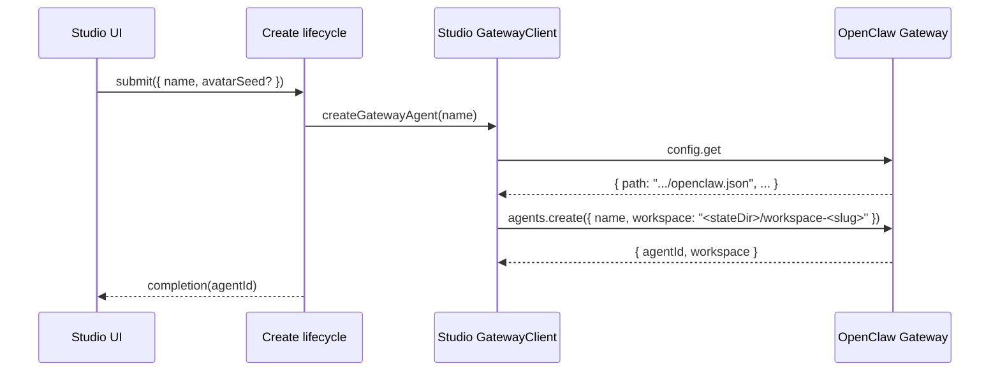

# Разрешения, песочница и рабочие пространства (Studio → шлюз → PI)

Этот документ нужен, чтобы быстро ввести в курс дела агентов-программистов при отладке:
- почему агент может или не может читать и записывать файлы;
- почему выполнение команд требует одобрения (или не требует);
- почему запуск в песочнице ведёт себя иначе, чем запуск без неё;
- как выбор при «создании агента» в **Office3D** доходит до **шлюза OpenClaw** (часто работающего на хосте EC2), где на самом деле и применяются ограничения.

Что охватывает документ:
- создание агента в Studio за один шаг и последующие изменения полномочий, включая точные вызовы шлюза;
- реализацию в вышестоящем OpenClaw, которая сохраняет эти настройки и применяет их во время выполнения.

Что не охватывает:
- внутреннюю логику рассуждений и цепочку инструментов PI целиком. Studio не реализует логику PI — он настраивает и показывает сессию шлюза;
- приватные инструкции по EC2, SSH и имена хостов. Документ должен оставаться безопасным для репозитория.

## Как это устроено (с самых основ)

Studio — это интерфейс плюс прокси. В части «разрешений» он делает две вещи:
1. Записывает **конфигурацию** в шлюз (переопределения для отдельных агентов в `openclaw.json`).
2. Записывает **политику** в шлюз (одобрения выполнения команд для отдельных агентов в `exec-approvals.json`).

Точка применения ограничений — шлюз (OpenClaw):
- он решает, работает ли сессия в песочнице;
- он решает, какое рабочее пространство монтируется в песочницу;
- он собирает набор инструментов PI (read/write/edit/apply_patch/exec и т. д.) на основе конфигурации и контекста песочницы;
- он запрашивает одобрение выполнения команд, когда этого требует политика, и рассылает события одобрения.

## Словарь

- **Шлюз (Gateway)**: WebSocket-сервер шлюза OpenClaw (вышестоящий проект).
- **Studio**: этот репозиторий. Интерфейс на Next.js плюс Node-прокси для WS.
- **Агент**: запись агента OpenClaw в конфигурации шлюза (`agents.list[]`).
- **Ключ сессии**: идентификатор сессии OpenClaw. Для «главной» сессии агента Studio использует `agent:<agentId>:<mainKey>`.
- **Рабочее пространство агента**: каталог в файловой системе хоста шлюза, настраиваемый для каждого агента (там лежат начальные файлы и правки).
- **Рабочее пространство песочницы**: отдельный каталог, который используется, когда сессия работает в песочнице, а `workspaceAccess` — не `rw`.
- **Режим песочницы** (`sandbox.mode`): когда включать песочницу (`off`, `non-main`, `all`).
- **Доступ к рабочему пространству** (`sandbox.workspaceAccess`): как песочница связана с рабочим пространством агента (`none`, `ro`, `rw`).
- **Политика инструментов** (`tools.profile`, `tools.alsoAllow`, `tools.deny`): разрешения и запреты для инструментов PI (итоговую политику вычисляет OpenClaw).
- **Политика одобрения выполнения команд**: `{ security, ask, allowlist }` для каждого агента, хранится в файле одобрений; определяет UX «Разрешить один раз / Разрешать всегда / Запретить».

## Studio: где выбираются «разрешения»

Создание агента намеренно сделано лёгким:
- `src/features/agents/components/AgentCreateModal.tsx` получает `name` и необязательное зерно для перемешивания аватара.
- `src/features/agents/operations/mutationLifecycleWorkflow.ts` применяет очередь и защитные проверки и вызывает создание.
- `src/lib/gateway/agentConfig.ts` (`createGatewayAgent`) выполняет `config.get` + `agents.create`.

После создания Studio применяет разрешающий набор возможностей по умолчанию:
- Выполнение команд: `Auto` («Авто»)
- Доступ в интернет: `On` («Вкл.»)
- Работа с файлами: `On` («Вкл.»)

Реализация:
- `src/app/page.tsx` (`handleCreateAgentSubmit`) применяет `CREATE_AGENT_DEFAULT_PERMISSIONS`.
- `src/features/agents/operations/agentPermissionsOperation.ts` (`updateAgentPermissionsViaStudio`) сохраняет эти значения по умолчанию.

Дальнейшие изменения возможностей делаются на вкладке «Возможности»:
- `src/features/agents/operations/agentPermissionsOperation.ts` (`updateAgentPermissionsViaStudio`)
  - обновляет одобрения выполнения команд для агента (`exec.approvals.get` + `exec.approvals.set`);
  - обновляет переопределения групп инструментов для выполнения, интернета и файлов (`config.get` + `config.patch` через `updateGatewayAgentOverrides`);
  - обновляет поведение выполнения команд в сессии (`sessions.patch` через `syncGatewaySessionSettings`).

### Группы инструментов среды выполнения, которые используются при изменении возможностей

Изменения возможностей в Studio опираются на раскрытие групп инструментов в OpenClaw (`openclaw/src/agents/tool-policy.ts`), в частности:
- `group:runtime` → инструменты выполнения (`exec`, `process`)

Внутренняя деталь сопоставления:
- Режим команд `off|ask|auto` сопоставляется с ролевой логикой (`conservative|collaborative|autonomous`) при генерации политики.
- Интерфейс показывает прямые переключатели возможностей, а не названия ролей.

## Studio → шлюз: «Создание агента» от начала до конца

Основные точки входа:
- `src/features/agents/operations/mutationLifecycleWorkflow.ts`
- `src/lib/gateway/agentConfig.ts` (`createGatewayAgent`)

Последовательность:

### Как Studio выбирает путь рабочего пространства по умолчанию

Studio вычисляет путь рабочего пространства по умолчанию из пути конфигурации шлюза:
- `src/lib/gateway/agentConfig.ts` (`createGatewayAgent`)

Логика:
1. Вызвать `config.get` и прочитать `snapshot.path` (путь к конфигурации на хосте шлюза).
2. Вычислить `stateDir = dirname(configPath)`.
3. Вычислить `workspace = join(stateDir, "workspace-" + slugify(name))`.
4. Вызвать `agents.create({ name, workspace })`.

Важно: для удалённого шлюза (EC2) этот путь `workspace` относится к файловой системе хоста шлюза, а не вашего ноутбука.

## Studio: синхронизация списка разрешённых переменных окружения песочницы (текущие рамки)

Процесс создания больше не выполняет записи настроек при первоначальном создании. Если Studio нужно обеспечить записи в списке разрешённых переменных окружения песочницы, это поведение должно быть привязано к явным операциям с настройками и конфигурацией, а не к побочным эффектам при создании.

## OpenClaw (вышестоящий): что на самом деле делает `agents.create`

Метод шлюза:
- `openclaw/src/gateway/server-methods/agents.ts` (`"agents.create"`)

Ключевое поведение:
- Нормализует `agentId` из переданного `name` (и резервирует `"default"`).
- Использует переданный `workspace` и приводит его к абсолютному пути.
- Записывает в конфигурацию запись для агента (включая каталог рабочего пространства и каталог агента).
- Проверяет, что каталог рабочего пространства существует и начальные файлы на месте (если не задан `agents.defaults.skipBootstrap`).
- Проверяет, что для агента существует каталог переписок сессий.
- Записывает файл конфигурации только после того, как эти каталоги созданы (чтобы не сохранить сломанную запись агента).
- Дописывает `- Name: ...` (и, при наличии, эмодзи/аватар) в `IDENTITY.md` в рабочем пространстве.

Итак: «рабочее пространство» — это не понятие одного лишь интерфейса, а настоящий каталог, созданный на хосте шлюза.

## OpenClaw (вышестоящий): семантика песочницы

Разрешение конфигурации песочницы:
- `openclaw/src/agents/sandbox/config.ts` (`resolveSandboxConfigForAgent`)

Создание контекста песочницы (здесь выбирается рабочее пространство):
- `openclaw/src/agents/sandbox/context.ts` (`resolveSandboxContext`)

Поведение монтирования в Docker:
- `openclaw/src/agents/sandbox/docker.ts` (`createSandboxContainer`)

### Режим песочницы (`sandbox.mode`)

Режимы (как они реализованы в вышестоящем проекте):
- `off`: сессии не работают в песочнице.
- `all`: каждая сессия работает в песочнице.
- `non-main`: в песочнице работают все сессии, кроме главного ключа сессии агента.

Сравнение с «главным ключом сессии» выполняется с настроенным главным ключом с приведением псевдонимов к каноническому виду:
- Вышестоящий проект приводит ключ сессии к каноническому виду перед сравнением, чтобы псевдонимы главной сессии считались «главной» (см. `canonicalizeMainSessionAlias` в runtime-status песочницы вышестоящего проекта).
- Если `session.scope` равен `global`, главный ключ сессии — `global`, и `non-main` фактически означает «песочница для всего, кроме глобальной сессии».

Ссылка на реализацию в вышестоящем проекте:
- `openclaw/src/agents/sandbox/runtime-status.ts` (`resolveSandboxRuntimeStatus`)

### Область песочницы (`sandbox.scope`)

Область песочницы определяет, как песочницы разделяются между сессиями и, следовательно, что сохраняется между запусками:
- `session`: рабочее пространство/контейнер песочницы на каждую сессию (максимальная изоляция, больше всего пересозданий);
- `agent`: рабочее пространство/контейнер песочницы на каждого агента по его id (общие для всех сессий этого агента);
- `shared`: одно рабочее пространство/контейнер песочницы на всё (минимальная изоляция).

Ссылки на реализацию в вышестоящем проекте:
- `openclaw/src/agents/sandbox/types.ts` (`SandboxScope`)
- `openclaw/src/agents/sandbox/shared.ts` (`resolveSandboxScopeKey`)

### Доступ к рабочему пространству (`sandbox.workspaceAccess`)

Поведение в вышестоящем проекте (важно):
- `rw`:
  - Песочница использует **рабочее пространство агента** как свой корень.
  - Инструменты PI для файловой системы (`read`/`write`/`edit`/`apply_patch`) работают с рабочим пространством агента.
- `ro`:
  - Песочница использует **рабочее пространство песочницы** как свой корень (каталог песочницы, доступный для записи).
  - Настоящее рабочее пространство агента монтируется в `/agent` только для чтения — для просмотра из командной строки.
  - Инструменты PI для файловой системы дополнительно ограничены: в этом режиме вышестоящий проект отключает write/edit/apply_patch (см. ниже).
- `none`:
  - Песочница использует **рабочее пространство песочницы** как свой корень.
  - Рабочее пространство агента в контейнер не монтируется.

Корень рабочих пространств песочниц по умолчанию:
- `openclaw/src/agents/sandbox/constants.ts` использует `<STATE_DIR>/sandboxes` (где `STATE_DIR` по умолчанию `~/.openclaw`, если не переопределён через `OPENCLAW_STATE_DIR`).

Начальное наполнение рабочего пространства песочницы:
- Когда корнем служит рабочее пространство песочницы, вышестоящий проект копирует недостающие начальные файлы из рабочего пространства агента и проверяет, что они на месте:
  - `openclaw/src/agents/sandbox/workspace.ts` (`ensureSandboxWorkspace`)
  - Рабочее пространство песочницы также синхронизирует навыки из рабочего пространства агента (по мере возможности) в `resolveSandboxContext`.

### Жёсткое ограничение: защита корня для файловых инструментов

В вышестоящем OpenClaw файловые инструменты в песочнице привязаны к корню и защищены:
- `openclaw/src/agents/pi-tools.read.ts` (использование `assertSandboxPath`)

Результат:
- Инструменты `read`/`write`/`edit` не могут обращаться к путям вне корня песочницы, даже если у контейнера есть другие точки монтирования (например, `/agent`).

Так задумано: у «файловых инструментов» и «инструмента exec» внутри песочницы разные права доступа.

## Политика инструментов песочницы (отдельно от переопределений инструментов для агента)

В OpenClaw есть дополнительная политика разрешений и запретов инструментов, действующая только в песочнице:
- `tools.sandbox.tools.allow|deny` (глобально)
- `agents.list[].tools.sandbox.tools.allow|deny` (переопределение для агента)

Разрешение в вышестоящем проекте:
- `openclaw/src/agents/sandbox/tool-policy.ts` (`resolveSandboxToolPolicyForAgent`)

Важный нюанс:
- Если `tools.sandbox.tools.allow` задан и не пуст, он становится списком разрешённых.
- Если он задан пустым массивом, вышестоящий проект всё равно автоматически добавит в список разрешённых `image` (если он явно не запрещён), и «пустой» список фактически превращается в «только image».
- Если в политике песочницы нужна семантика «разрешить всё», используйте `["*"]`, а не `[]`, чтобы обойти пограничный случай с автоматическим добавлением image.

Именно поэтому Studio считает некоторые конфигурации «сломанными» и исправляет их (см. ниже).

### Слои политики (почему «разрешённое» всё равно может быть заблокировано)

В сессии в песочнице инструмент должен пройти несколько проверок:
- обычные проверки политики инструментов (`tools.profile`, `tools.allow|alsoAllow`, `tools.deny`, а также любые политики поставщиков, групп и субагентов, которые применяет вышестоящий проект);
- проверку политики инструментов песочницы (`tools.sandbox.tools.allow|deny`, вычисленную для этого агента).

Поэтому, даже если Studio включит `group:runtime` для агента, инструмент всё равно может быть заблокирован в сессиях в песочнице, если его запрещает политика инструментов песочницы.

## OpenClaw (вышестоящий): доступность инструментов и `workspaceAccess=ro`

Сборка инструментов PI:
- `openclaw/src/agents/pi-tools.ts` (`createOpenClawCodingTools`)

Ключевые ограничения:
- В песочнице вышестоящий проект убирает обычные инструменты хоста `write`/`edit`.
- Инструменты `write`/`edit` для песочницы добавляются, только если `workspaceAccess !== "ro"`.
- `apply_patch` в песочнице отключается, когда `workspaceAccess === "ro"`.

Поэтому «`workspaceAccess=ro`» означает больше, чем «смонтировать только для чтения»:
- это ещё и проверка политики инструментов, которая не даёт напрямую записывать и править файлы через инструменты PI.

### Примечание о Studio: полномочия больше не вычисляются при создании

Процесс создания в Studio больше не вычисляет настройки полномочий и песочницы при первоначальном создании.

Когда возможности меняются после создания, Studio использует:
- `src/features/agents/operations/agentPermissionsOperation.ts` (`updateAgentPermissionsViaStudio`)

Эта операция обновляет:
- политику одобрения выполнения команд (`exec.approvals.set`);
- переопределения инструментов для агента (`config.patch` через `updateGatewayAgentOverrides`);
- host/security/ask выполнения команд в сессии (`sessions.patch`).

Ограничения в вышестоящем проекте не изменились: `workspaceAccess="ro"` по-прежнему отключает PI `write`/`edit`/`apply_patch` в сессиях в песочнице.

## Настройки выполнения команд на уровне сессии (где запускается `exec`)

Помимо конфигурации агента и одобрений выполнения команд, OpenClaw поддерживает настройки выполнения команд для отдельной сессии:
- `execHost`: `sandbox | gateway | node`
- `execSecurity`: `deny | allowlist | full`
- `execAsk`: `off | on-miss | always`

Они хранятся в хранилище сессий шлюза и меняются через `sessions.patch`:
- Метод в вышестоящем проекте: `openclaw/src/gateway/server-methods/sessions.ts` (`"sessions.patch"`)
- Применение изменений: `openclaw/src/gateway/sessions-patch.ts`
- Форма записи сессии включает `execHost|execSecurity|execAsk`: `openclaw/src/config/sessions/types.ts`

Studio использует эти поля, чтобы «ожидания интерфейса» совпадали с поведением шлюза во время выполнения:
- При гидратации ожидаемые значения выводятся из политики одобрения выполнения команд и режима песочницы:
  - `src/features/agents/operations/agentFleetHydrationDerivation.ts`
  - Особый случай: если `sandbox.mode === "all"` и есть переопределения выполнения команд, Studio принудительно ставит `execHost = "sandbox"`, чтобы случайно не выполнить команды на хосте.
- При первой отправке (или при рассинхронизации) Studio обновляет сессию:
  - `src/features/agents/operations/chatSendOperation.ts` вызывает `syncGatewaySessionSettings(...)`
  - Транспорт: `src/lib/gateway/GatewayClient.ts` (`sessions.patch`)

Итоговый эффект:
- Политика одобрения выполнения команд определяет, будут ли у пользователя спрашивать одобрение.
- Настройки выполнения команд в сессии определяют, где идёт выполнение (в песочнице или на хосте), и значения `security/ask` по умолчанию для запусков.

## OpenClaw (вышестоящий): одобрения выполнения команд (политика и события)

Файл одобрений выполнения команд (значения по умолчанию в вышестоящем проекте):
- `openclaw/src/infra/exec-approvals.ts`
  - путь к файлу по умолчанию: `~/.openclaw/exec-approvals.json`
  - путь к сокету по умолчанию: `~/.openclaw/exec-approvals.sock`

Методы шлюза (сохранение политики):
- `openclaw/src/gateway/server-methods/exec-approvals.ts`
  - `exec.approvals.get` возвращает `{ path, exists, hash, file }` (токен сокета в ответах скрыт)
  - `exec.approvals.set` требует совпадающий `baseHash`, если файл уже существует (защита от потери изменений)

Запрос и решение по одобрению плюс рассылка событий:
- `openclaw/src/gateway/server-methods/exec-approval.ts`
  - рассылает `exec.approval.requested`
  - рассылает `exec.approval.resolved`

Логика решения об одобрении для инструмента exec:
- `openclaw/src/agents/bash-tools.exec.ts` (вызывает `requiresExecApproval`, `evaluateShellAllowlist` и т. д.)

Как Studio сохраняет политику:
- Studio записывает политику агента через `exec.approvals.set`:
  - `src/lib/gateway/execApprovals.ts` (`upsertGatewayAgentExecApprovals`)

Как Studio показывает это в интерфейсе:
- Studio слушает `exec.approval.requested` и `exec.approval.resolved` и показывает карточки одобрения прямо в чате.
- Когда пользователь нажимает «разрешить» или «запретить», Studio вызывает `exec.approval.resolve`.

## Чек-лист отладки (когда что-то кажется «не так»)

1. Определите, работает ли сессия в песочнице и какое рабочее пространство она использует.
   - Вспомогательная команда CLI вышестоящего проекта: `openclaw sandbox explain --agent <agentId>` (см. `src/commands/sandbox-explain.ts` в вышестоящем проекте)
2. Проверьте, что записал Studio:
   - Переопределения агента: `config.get` и запись агента в `agents.list[]`.
   - Одобрения выполнения команд: `exec.approvals.get` и `file.agents[agentId]`.
3. Если правки файлов не происходят:
   - Проверьте `sandbox.workspaceAccess` (при `ro` вышестоящий проект отключает в песочнице инструменты write/edit/apply_patch).
   - Проверьте политику инструментов (`tools.profile`, `tools.alsoAllow`, `tools.deny`) на явные запреты `write`/`edit`/`apply_patch`.
4. Если запросы на одобрение не появляются:
   - Проверьте `security` + `ask` в одобрениях выполнения команд.
   - Проверьте шаблоны списка разрешённых (совпадение может подавлять запросы при `ask=on-miss`).
5. Если агент видит не те файлы, которые вы ожидаете:
   - `workspaceAccess=rw` означает «инструменты работают с рабочим пространством агента».
   - `workspaceAccess=ro|none` означает «инструменты работают с рабочим пространством песочницы».
   - Точка монтирования `/agent` есть только при `workspaceAccess=ro` и доступна через exec в песочнице, а не через файловые инструменты.

## «Разрешения» в Studio после создания (не только при создании)

Studio может менять разрешения и у уже существующего агента.

### Изменение разрешений на вкладке «Возможности»

Процесс разрешений в Studio применяет согласованные изменения одним сохранением:
- политика одобрения выполнения команд (для агента, хранится в файле одобрений);
- разрешение или запрет инструментов для групп выполнения/интернета/файлов (`group:runtime`, `group:web`, `group:fs`) в конфигурации агента;
- настройки выполнения команд в сессии (`execHost|execSecurity|execAsk`) через `sessions.patch`.

Код:
- `src/features/agents/operations/agentPermissionsOperation.ts` (`updateAgentPermissionsViaStudio`)

Модель интерфейса:
- Прямые переключатели: «Выполнение команд» (`Off`/`Ask`/`Auto` — «Выкл.»/«Спрашивать»/«Авто»), «Доступ в интернет» (`Off`/`On`), «Работа с файлами» (`Off`/`On`).
- Окно создания по-прежнему почти не касается разрешений (только имя и аватар), а процесс создания сразу применяет разрешающие значения по умолчанию (`Auto`, интернет включён, работа с файлами включена).

Почему это важно:
- Одобрения выполнения команд могут быть настроены, а запускать команды всё равно нельзя, если запрещена `group:runtime`.
- Одобрения могут быть разрешающими, но всё остаётся безопасным, если при включённой песочнице `execHost` принудительно установлен в `sandbox`.

### Разовое исправление политики инструментов песочницы

При подключении Studio просматривает конфигурацию шлюза в поисках агентов, которые работают в песочнице (`sandbox.mode === "all"`) и у которых явно пустой список разрешённых инструментов песочницы (`tools.sandbox.tools.allow = []`), и исправляет такие записи, устанавливая:
- `agents.list[].tools.sandbox.tools.allow = ["*"]`

Код:
- Обнаружение и постановка исправления в очередь: `src/app/page.tsx` (`repair-sandbox-tool-allowlist`)
- Запись в шлюз: `src/lib/gateway/agentConfig.ts` (`updateGatewayAgentOverrides`)

Это нужно, чтобы сессии в песочнице не теряли фактически доступ почти ко всем инструментам песочницы из-за того, что пустой список разрешённых взаимодействует с поведением политики инструментов песочницы в вышестоящем проекте.
