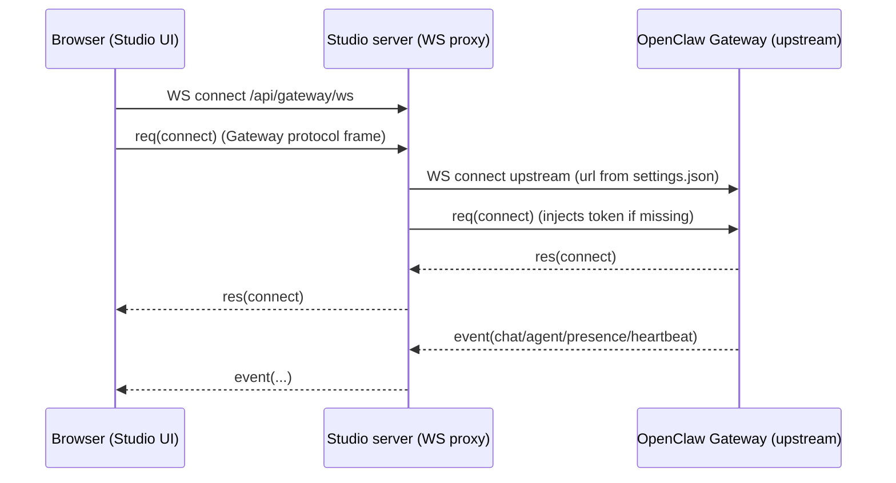

# PI и потоковая передача чата (сторона Studio)

Этот документ нужен, чтобы быстро ввести в курс дела агентов-программистов, отлаживающих проблемы с чатом в Office3D.

Охват:
- Описывает, как Studio подключается к шлюзу OpenClaw, как потоковые данные среды выполнения приходят по WebSocket и как UI их отображает.
- Под **PI** понимается «агент-программист, работающий за шлюзом» (агент OpenClaw). Studio не реализует логику PI — он отображает сессию шлюза и управляет ею.

Вне охвата:
- Внутреннее устройство PI и детали выполнения моделей и инструментов. Они находятся в репозитории OpenClaw и реализации шлюза.

## Ключевые файлы (начните отсюда)

- Точка входа сервера Studio и обработка upgrade: `server/index.js`
- WS-мост браузера к вышестоящему шлюзу: `server/gateway-proxy.js`
- WS URL для браузера (всегда same-origin `/api/gateway/ws`): `src/lib/gateway/proxy-url.ts`
- Браузерный клиент протокола шлюза (vendored-копия): `src/lib/gateway/openclaw/GatewayBrowserClient.ts`
- Обёртка шлюза в Studio и политика подключения: `src/lib/gateway/GatewayClient.ts`
- Классификация потоков среды выполнения и вспомогательные функции слияния: `src/features/agents/state/runtimeEventBridge.ts`
- Исполнитель событий среды выполнения (поток -> состояние -> строки переписки): `src/features/agents/state/gatewayRuntimeEventHandler.ts`
- Отрисовка чата: `src/features/agents/components/AgentChatPanel.tsx`, `src/features/agents/components/chatItems.ts`
- Разбор сообщений (маркеры текста / размышлений / инструментов): `src/lib/text/message-extract.ts`
- Синхронизация истории и слияние переписки: `src/features/agents/operations/historySyncOperation.ts`, `src/features/agents/state/transcript.ts`

## Связь с OpenClaw (что скопировано сюда)

Studio содержит vendored-копию браузерного клиента шлюза, который говорит на протоколе шлюза:
- Скопированный клиент: `src/lib/gateway/openclaw/GatewayBrowserClient.ts`
- Скрипт синхронизации: `scripts/sync-openclaw-gateway-client.ts`
- Источник синхронизации: явно укажите локальный путь к источнику для скрипта синхронизации через аргумент CLI или переменную окружения.

Важно:
- Сейчас Studio не синхронизирует `GatewayBrowserClient.ts` автоматически из фиксированного локального пути у мейнтейнера.
- Если есть подозрение на несоответствие протокола, сначала убедитесь, что исходный файл синхронизации и файлы среды выполнения / протокола вышестоящего шлюза согласованы.

Если есть подозрение на несоответствие протокола (отсутствуют поля событий, переименованы потоки, другие коды ошибок), начните с проверки того, синхронизирован ли скопированный в Studio клиент с версией шлюза, которую вы запускаете.

## Источник истины в вышестоящем проекте (OpenClaw)

Для поведения потоковой передачи чата авторитетны следующие файлы вышестоящего проекта:
- `src/gateway/protocol/schema/logs-chat.ts` в вашей копии OpenClaw (`chat.send`, `chat.history` и схема событий чата)
- `src/gateway/server-methods/chat.ts` в вашей копии OpenClaw (подтверждение `chat.send` и идемпотентность, формирование / очистка полезной нагрузки `chat.history`)
- `src/gateway/server-chat.ts` в вашей копии OpenClaw (рассылка событий `agent` и синтетический мост `chat` delta/final)
- `src/agents/pi-embedded-subscribe.ts` и связанные обработчики в вашей копии OpenClaw (отправка потоков `assistant`/`tool`/`lifecycle`)

Обновляя этот документ, проверяйте поведение по этим файлам, а не по предположениям.

## Терминология

- Studio: этот репозиторий, UI на Next.js с собственным Node-сервером.
- Шлюз (вышестоящий): WebSocket-сервер шлюза OpenClaw (по умолчанию `ws://localhost:18789`).
- WS-мост / прокси: серверный WebSocket Studio, который связывает браузер с вышестоящим шлюзом.
- Фрейм: JSON-сообщение по WebSocket (запрос / ответ / событие).
- Запуск (run): одно потоковое выполнение, идентифицируемое по `runId`.
- Сессия: идентифицируется по `sessionKey` (для основных сессий Studio использует `agent:<agentId>:<mainKey>`).

## Сетевой путь в общих чертах

Есть два отдельных перехода по WebSocket плюс запрос `connect` на уровне протокола:



Файлы:
- Точка входа WS-прокси: `server/index.js`
- Реализация WS-прокси: `server/gateway-proxy.js`

Примечания:
- Браузер никогда не открывает WebSocket напрямую к URL вышестоящего шлюза. Браузер всегда общается с same-origin мостом Studio по адресу `/api/gateway/ws` (вычисляется в `src/lib/gateway/proxy-url.ts`).
- «URL вышестоящего шлюза», который показан в настройках Studio, использует сервер Studio (прокси), чтобы открыть вышестоящее подключение.

## Сквозной поток (запуск PI -> UI)

Вот «счастливый путь», который стоит держать в голове при отладке:

1. Пользователь вводит текст в поле чата и нажимает «Отправить» (`src/features/agents/components/AgentChatPanel.tsx`).
2. Studio вызывает `chat.send` с `sessionKey` и `idempotencyKey = runId` (`src/features/agents/operations/chatSendOperation.ts`).
3. Шлюз запускает агента (PI) для этой сессии.
4. Пока запуск выполняется, шлюз может передавать потоком:
   - фреймы `event: "agent"` с частичным выводом в реальном времени (`stream: "assistant"`), размышлениями в реальном времени (потоки `reason*`/`think*`), вызовами инструментов и их результатами (`stream: "tool"`) и жизненным циклом (`stream: "lifecycle"`);
   - фреймы `event: "chat"` с потоком сообщений чата (`state: "delta" | "final" | ...`);
   - оба потока могут описывать ход одного и того же запуска с разных уровней (события потока `agent` и события сообщений `chat`), поэтому Studio должен сливать их идемпотентно.
5. Studio сливает эти события в:
   - живые поля (`streamText`, `thinkingTrace`) через пакетный `queueLivePatch` (быстрые обновления UI без фиксации в переписке);
   - зафиксированные строки переписки (`outputLines`) через `appendOutput` (финальные сообщения, строки инструментов, мета-данные / временная метка, ход размышлений).
6. Панель чата отображает:
   - историческую переписку из `outputLines`;
   - дополнительную карточку «живого ассистента» внизу, собранную из `streamText` + `thinkingTrace`, пока `status === "running"`.

Ключевая связка находится в:
- Подписка на события и диспетчеризация: `src/app/page.tsx`
- Обработчик событий среды выполнения: `src/features/agents/state/gatewayRuntimeEventHandler.ts`
- Редьюсер хранилища: `src/features/agents/state/store.tsx`

## Настройки Studio (откуда берутся URL и токен шлюза)

Studio хранит настройки подключения к шлюзу на хосте Studio (а не в постоянном хранилище браузера). UI при этом всё равно загружает их в память браузера во время работы:
- `~/.openclaw/office3d/settings.json` (каноническое расположение см. в `README.md`)

WS-прокси загружает эти настройки на стороне сервера и открывает вышестоящее подключение.

Файлы:
- Доступ к файлу настроек (WS-прокси): `server/studio-settings.js`
- API-маршрут настроек (браузер -> сервер): `src/app/api/studio/route.ts`
- Клиентский координатор загрузки / изменения: `src/lib/studio/coordinator.ts`
- Хранение настроек и резервное поведение, используемые `/api/studio`: `src/lib/studio/settings-store.ts`

Примечание о подключении:
- В браузере `useGatewayConnection()` хранит URL и токен вышестоящего шлюза в памяти (загружая их из `/api/studio`), но подключает WebSocket к Studio через `resolveStudioProxyGatewayUrl()`; URL вышестоящего шлюза передаётся как `authScopeKey` (а не как URL WebSocket). См. `src/lib/gateway/GatewayClient.ts`.

Примечание о выборе токена:
- Сервер Studio берёт токен вышестоящего шлюза из `office3d/settings.json`, а если его там нет, может использовать локальную конфигурацию OpenClaw из `openclaw.json` (токен + порт). Это поведение есть и в пути WS-прокси (`server/studio-settings.js`), и в слое хранения `/api/studio` (`src/lib/studio/settings-store.ts`), и они должны оставаться согласованными.
- Во время `connect` WS-прокси передаёт аутентификацию, предоставленную браузером (`params.auth.token` или `params.device.signature`), без изменений. Токен, найденный на хосте, он подставляет только при отсутствии аутентификации от браузера. `studio.gateway_token_missing` возвращается, только если нет ни аутентификации от браузера, ни токена на хосте.

## Структура фреймов WebSocket

Studio ожидает от шлюза фреймы такого вида:

```json
{ "type": "req", "id": "uuid", "method": "connect", "params": { } }
{ "type": "res", "id": "uuid", "ok": true, "payload": { } }
{ "type": "res", "id": "uuid", "ok": false, "error": { "code": "…", "message": "…" } }
{ "type": "event", "event": "chat", "payload": { } }
```

Типы находятся в:
- `src/lib/gateway/GatewayClient.ts`

### Рукопожатие connect

Первым *фреймом протокола* от браузера должен быть `req(connect)`. WS-прокси:
- Отклоняет фреймы, отличные от `connect`, пока подключение не установлено.
- Открывает вышестоящий WS к настроенному URL шлюза.
- Подставляет `auth.token` в параметры connect, если фрейм connect ещё не содержит токен и не содержит подписи устройства.
- Возвращает `studio.gateway_token_missing`, только если нет аутентификации от браузера и не удаётся найти токен на хосте.
- Устанавливает для вышестоящего WebSocket заголовок `Origin`, выведенный из URL вышестоящего шлюза (и приводит loopback-имена хостов к `localhost`).

Код:
- Проверка connect и подстановка токена: `server/gateway-proxy.js`

### Сбои подключения

Если не удалось загрузить настройки или открыть вышестоящее подключение, прокси отправляет ошибочный `res` на запрос connect (когда это возможно), а затем закрывает WS.

Важная деталь (как ошибки превращаются в понятные действия в UI):
- Браузерный клиент шлюза (`src/lib/gateway/openclaw/GatewayBrowserClient.ts`) закрывает WebSocket с кодом `4008` и причиной вида `connect failed: <CODE> <MESSAGE>` после получения неуспешного `res(connect)`. `GatewayClient.connect()` разбирает это закрытие в `GatewayResponseError(code, message)` для политики повторов в UI и ошибок, показываемых пользователю.
- Отдельно от этого прокси тоже может закрыть соединение с `1011` / `connect failed`; причину закрытия «connect failed: …», которую разбирает UI, формирует браузерный клиент, а не прокси.
- Причины закрытия WebSocket в браузерном клиенте обрезаются до 123 байт UTF-8, чтобы избежать ошибок протокола на длинных сообщениях.

Коды ошибок, которые использует прокси:
- `studio.gateway_url_missing`
- `studio.gateway_token_missing`
- `studio.gateway_url_invalid`
- `studio.settings_load_failed`
- `studio.upstream_error`
- `studio.upstream_closed`

## Переподключения и повторы

Есть два уровня повторных попыток:

- Переподключение транспорта (после успешного hello): скопированный браузерный клиент переподключает WebSocket браузер->Studio с нарастающей задержкой, когда тот закрывается, и продолжает отправлять события после переподключения. См. `src/lib/gateway/openclaw/GatewayBrowserClient.ts`.
- Повтор при сбое первоначального подключения: если первоначальное рукопожатие `connect` не удалось (например, неверный токен), `GatewayClient.connect()` уничтожает скопированный клиент и возвращает отклонённый промис; `useGatewayConnection()` может запланировать ограниченное число повторов, если код ошибки не входит в известные неповторяемые. См. `resolveGatewayAutoRetryDelayMs` в `src/lib/gateway/GatewayClient.ts`.

## Контроль доступа к Studio

Когда Studio привязан к публичному хосту, `STUDIO_ACCESS_TOKEN` обязателен. При привязке только к loopback он остаётся необязательным. Если он включён, Studio применяет простой контроль доступа:
- HTTP: блокирует маршруты `/api/*`, если нет правильной cookie `studio_access`.
- WebSocket: блокирует upgrade на `/api/gateway/ws`, если нет этой cookie.

Файлы:
- Реализация контроля доступа: `server/access-gate.js`
- Подключение контроля доступа для WS upgrade: `server/index.js`

## Потоковая передача: что отправляет шлюз и как это использует Studio

Studio классифицирует события шлюза по имени `event`:
- `presence`, `heartbeat`: триггеры обновления сводки
- `chat`: сообщения чата среды выполнения (delta/final)
- `agent`: дельты среды выполнения по отдельным потокам (assistant/thinking/tool/lifecycle)

Код:
- Классификация: `src/features/agents/state/runtimeEventBridge.ts`
- Исполнение: `src/features/agents/state/gatewayRuntimeEventHandler.ts`

## Живые поля и зафиксированная переписка (почему поток может «выглядеть странно»)

Studio намеренно разделяет:
- Живой потоковый UI: `AgentState.streamText` и `AgentState.thinkingTrace` обновляются через `queueLivePatch`, который собирает изменения в пакеты и объединяет несколько дельт, прежде чем они попадут в состояние React (`src/app/page.tsx`).
- Зафиксированную переписку: в `AgentState.outputLines` строки добавляются через `appendOutput`. Именно эти строки становятся постоянной перепиской на экране и позже сливаются с результатами `chat.history` (`src/features/agents/state/store.tsx`).

Из-за этого разделения можно увидеть, как:
- «живой» вывод ассистента быстро обновляется в нижней карточке во время запуска,
- а затем по `final` в переписке появляется финальное сообщение ассистента (плюс строки инструментов / ход размышлений / мета-временная метка).

### Полезная нагрузка `event: "chat"`

Studio считает события `chat` каноническим потоком «сообщений» для завершения переписки. Ожидаемые поля:
- `runId`
- `sessionKey`
- `state`: `delta | final | aborted | error`
- `message` (структура бывает разной; Studio извлекает текст / размышления / метаданные инструментов с защитой от ошибок)

Ключевое поведение (на стороне Studio):
- Игнорирует роли user/system при добавлении в переписку (но использует их для статуса / сводки).
- Сообщения пользователя в переписке берутся в основном из локальной оптимистичной отправки и из синхронизации `chat.history` (а не из событий `chat` среды выполнения с ролью user).
- При `final` добавляет:
  - строку `[[meta]]{...}` (временная метка и длительность размышлений, если доступны);
  - блок размышлений `[[trace]]`, если его удалось извлечь;
  - markdown-строки вызовов и результатов инструментов, если они есть;
  - текст ассистента (если есть).
- Если финальное сообщение ассистента (`final`) приходит без извлекаемого хода размышлений, Studio может запросить `chat.history` для восстановления.
- `chat.send` в вышестоящем шлюзе использует ключ идемпотентности и возвращает подтверждение запуска до асинхронного завершения; поэтому сверка истории может соперничать с событиями среды выполнения и должна быть идемпотентной.

### Полезная нагрузка `event: "agent"`

Studio использует события `agent` для живой потоковой передачи и более подробных обновлений об инструментах и жизненном цикле. Ожидаемые поля:
- `runId`
- `stream`: `assistant | tool | lifecycle | <reasoning stream>`
- `data`: запись с `text`/`delta` и ключами, специфичными для потока

Обработка потоков (в общих чертах):
- `assistant`: сливает `data.delta` в живой `streamText` для UI.
- поток рассуждений (всё, что не `assistant`, `tool`, `lifecycle` и совпадает с подсказками вроде `reason`/`think`/`analysis`/`trace`): сливается в `thinkingTrace`.
- `tool`: форматирует строки вызова инструмента и его результата с помощью `[[tool]]` и `[[tool-result]]`.
- `lifecycle`: переходы start/end/error; если запуск дошёл до `end` без финальных событий chat, Studio может записать последний потоковый текст ассистента как резервную финальную запись переписки.

Код:
- Слияние потока агента среды выполнения и добавление строк: `src/features/agents/state/gatewayRuntimeEventHandler.ts`

## Как UI чата отображает поток

Studio хранит для каждого агента переписку `outputLines: string[]`, а также живые поля вроде `streamText` и `thinkingTrace`.

Конвейер отрисовки:
- `outputLines` содержит:
  - сообщения пользователя в виде `> ...`;
  - сообщения ассистента как сырой markdown-текст;
  - вызовы инструментов и их результаты с префиксами `[[tool]]` и `[[tool-result]]`;
  - необязательные мета-строки `[[meta]]{...}` для временных меток и длительности размышлений;
  - необязательные строки хода размышлений `[[trace]] ...`.
- Панель строит структурированные элементы чата из `outputLines` и (при необходимости) живого потокового состояния.
- Переключатели UI, влияющие на отрисовку:
  - `showThinkingTraces`: скрывает / показывает записи размышлений `[[trace]]`;
  - `toolCallingEnabled`: если выключен, строки инструментов скрываются, а некоторые результаты exec-инструментов могут показываться как текст ассистента.

### Контракт отрисовки

- Markdown ассистента отображается как markdown ассистента. Studio не оборачивает обычный markdown ассистента в синтетический контейнер `Output`.
- Карточки инструментов отображаются только из явных строк-маркеров: `[[tool]]` и `[[tool-result]]`.
- Видимость маркеров списков определяется стилями markdown чата в `src/app/styles/markdown.css`; разбор потока не придумывает маркеры списков сам.

Файлы:
- UI панели чата: `src/features/agents/components/AgentChatPanel.tsx`
- Разбор переписки на элементы: `src/features/agents/components/chatItems.ts`
- Вспомогательные функции извлечения из сообщений (разбор текста / размышлений / инструментов): `src/lib/text/message-extract.ts`
- Переписывание медиастрок (изображения / аудио / видео, отображаемые в markdown): `src/lib/text/media-markdown.ts`

## Отправка сообщений (браузер -> PI через шлюз)

Путь отправки (в общих чертах):
- UI отправляет сообщение через `sendChatMessageViaStudio()`, которая:
  - переводит агента в состояние running и очищает живые потоки;
  - при необходимости сбрасывает локальное состояние переписки для `/new` или `/reset` (локальное поведение UI);
  - оптимистично добавляет строку пользователя (`> ...`) в переписку;
  - перед первой отправкой однократно синхронизирует настройки сессии через `sessions.patch` (модель / размышления / настройки exec);
  - вызывает `chat.send` с `idempotencyKey = runId` и `deliver: false`.

Путь остановки:
- UI вызывает `chat.abort`, чтобы остановить активный запуск.

Файлы:
- Операция отправки: `src/features/agents/operations/chatSendOperation.ts`
- Транспорт синхронизации настроек сессии: `src/lib/gateway/GatewayClient.ts`
- Место вызова остановки: `src/app/page.tsx`

## Побочные эффекты после подключения (только локальный шлюз)

После успешного подключения Studio может изменить конфигурацию шлюза, если URL вышестоящего шлюза локальный:
- Он читает `config.get` и может записать `config.set`, чтобы `gateway.reload.mode` было `"hot"` для локального использования Studio.

Файл:
- Принудительная установка режима перезагрузки: `src/lib/gateway/gatewayReloadMode.ts`

## Пропуски в последовательности (потерянные события)

Фреймы событий шлюза могут содержать `seq`. Скопированный браузерный клиент отслеживает `seq` и сообщает о пропусках (`expected`, `received`) через `onGap`.

Поведение Studio при пропуске:
- Пишет предупреждение в лог.
- Принудительно обновляет снимок сводки и сверяет состояние выполняющихся агентов.

Файлы:
- Обнаружение пропусков: `src/lib/gateway/openclaw/GatewayBrowserClient.ts`
- Обработка пропусков: `src/app/page.tsx`

## Синхронизация истории (восстановление, «загрузить ещё»)

Studio может получать историю через `chat.history` и сливать её с перепиской.

Ключевые моменты:
- Studio намеренно считает историю шлюза канонической для временных меток и итогового порядка.
- Слияние истории устроено так, чтобы избегать дубликатов и сверять локальные оптимистичные отправки.
- Разбор истории намеренно пропускает некоторое служебное содержимое (промпты пульса, сообщения-маркеры перезапуска и префиксы метаданных UI). См. `buildHistoryLines()` в `src/features/agents/state/runtimeEventBridge.ts`.
- Переписку v2 можно включать и выключать через `NEXT_PUBLIC_STUDIO_TRANSCRIPT_V2`.
- Отладочные логи переписки включаются через `NEXT_PUBLIC_STUDIO_TRANSCRIPT_DEBUG`.

Файлы:
- Операция истории: `src/features/agents/operations/historySyncOperation.ts`
- Примитивы слияния / сортировки переписки: `src/features/agents/state/transcript.ts`

## Одобрения exec в чате (связано с «запусками PI»)

Некоторые запуски требуют одобрения exec. Они показываются как карточки в чате и обрабатываются отдельно от потока среды выполнения `chat`/`agent`.

Файлы:
- Событие -> состояние ожидающей карточки: `src/features/agents/approvals/execApprovalEvents.ts`
- Операция разрешения: `src/features/agents/approvals/execApprovalResolveOperation.ts`
- Связка (подписка + отрисовка): `src/app/page.tsx`, `src/features/agents/components/AgentChatPanel.tsx`

## Отрисовка медиа (изображения из вывода агента)

Если агент выводит строки вида:
- `MEDIA: /home/ubuntu/.openclaw/.../image.png`

Studio может отобразить их прямо в чате:
1. UI переписывает подходящие строки `MEDIA:` в markdown-изображения (``), но не трогает строки внутри огороженных блоков кода.
2. Браузер запрашивает `/api/gateway/media`.
3. API-маршрут читает изображение либо локально (только внутри `~/.openclaw`), либо по SSH для удалённых шлюзов и возвращает байты с правильным `Content-Type`.

Файлы:
- Вспомогательная функция переписывания: `src/lib/text/media-markdown.ts`
- API-маршрут медиа: `src/app/api/gateway/media/route.ts`
- Вспомогательный модуль SSH и переменные окружения (`OPENCLAW_GATEWAY_SSH_TARGET`, `OPENCLAW_GATEWAY_SSH_USER`): `src/lib/ssh/gateway-host.ts`

## Чек-лист отладки (когда чат «кажется глючным»)

Начните с того перехода, где проявляются симптомы.

WS-мост / связность:
- Логи сервера Studio (прокси): `server/gateway-proxy.js`
- Типичные сбои: перепутаны `ws://` и `wss://`, отсутствует токен, шлюз закрыл соединение, несоответствие TLS у вышестоящего шлюза

Корректность потока (пропавший / задвоенный вывод):
- Классификация событий и слияние потока среды выполнения: `src/features/agents/state/gatewayRuntimeEventHandler.ts`
- Особенности извлечения текста / размышлений / инструментов: `src/lib/text/message-extract.ts`
- Построение элементов UI и правила сворачивания: `src/features/agents/components/chatItems.ts`
- Дедупликация строк инструментов в рамках запуска и окно игнорирования закрытых запусков: `src/features/agents/state/gatewayRuntimeEventHandler.ts`

Проблемы с историей и порядком:
- Логика слияния `chat.history` и дедупликация: `src/features/agents/operations/historySyncOperation.ts`
- Порядок записей переписки / отпечатки: `src/features/agents/state/transcript.ts`

Медиа не отображаются:
- Поведение переписывания `MEDIA:` и пропуск блоков кода: `src/lib/text/media-markdown.ts`
- Поведение маршрута получения изображений (локально или по SSH, разрешённые расширения, ограничения размера): `src/app/api/gateway/media/route.ts`

Если нужна наблюдаемость на стороне шлюза:
- Зафиксируйте точные настройки `connect`, которые использует Studio (URL и токен хранятся на стороне сервера в файле настроек Studio).
- Изучите логи шлюза на его хосте с помощью инструментов управления сервисами и логами вашего окружения.
